# CT Log Collector & Live Dashboard

A **horizontally scalable CT (Certificate Transparency) log collection system** with built-in parsing, live dashboards, and real-time API access.

Designed for Docker Compose and ready for Kubernetes migration.

---

## **Features**

* **Self-contained collectors**: Fetch, parse, and filter CT logs.
* **Live updates**: WebSocket support for dashboard and API clients.
* **Central dashboard**: Monitor collectors, view metrics, and update settings dynamically.
* **API service**: Query certificates by domain and receive real-time updates.
* **Long-term storage**: parsed logs in PostgreSQL/TimescaleDB.
* **Horizontal scalability**: Add more collectors or API instances without downtime.
* **Decoupled architecture**: Redis Pub/Sub ensures real-time updates and high throughput.

---

## **Architecture Overview**

```mermaid
architecture-beta

group collectors_grp(cloud)[Collectors]

service collector1(service)[Collector 1] in collectors_grp
service collector2(service)[Collector 2] in collectors_grp
service collectorN(service)[Collector N] in collectors_grp

group database_grp(cloud)[Database Storage]

service db_ts(database)[PostgreSQL TimescaleDB] in database_grp
service redis(chache)[Redis Pub Sub] in database_grp

group apidash(cloud)[API Dashboard]

service apiService(service)[API Service] in apidash
service dashboard(service)[Web Dashboard] in apidash

group clients_grp(cloud)[External Clients]

service clients(service)[Clients] in clients_grp

%% Collector → Database
collector1:L -- R:db_ts
collector2:L -- R:db_ts
collectorN:L -- R:db_ts

%% Collector → Redis for live events
collector1:R -- L:redis
collector2:R -- L:redis
collectorN:R -- L:redis

%% Dashboard subscribes to Redis
redis:L -- R:dashboard

%% Dashboard → Collector configuration commands
dashboard:R -- L:collector1
dashboard:R -- L:collector2
dashboard:R -- L:collectorN

%% API subscribes to Redis
redis:L -- R:apiService

%% API queries database
apiService:L -- R:db_ts

%% API → Clients via WebSocket
apiService:R -- L:clients
```



* **Collectors**: Write parsed logs to DB, push live events to Redis.
* **Dashboard**: Subscribes to Redis for live status, sends config commands back to collectors.
* **API Service**: Queries database and pushes live updates to clients.
* **Redis Pub/Sub**: Decouples live event streaming from database writes.
* **MinIO**: Optional long-term storage for raw logs.

---

## **Getting Started**

### **Prerequisites**

* Docker & Docker Compose
* PostgreSQL / TimescaleDB

### **Clone the Repository**

```bash
git clone https://github.com/<your-username>/ct-log-collector.git
cd ct-log-collector
```

### **Environment Configuration**

Create a `.env` file in the root directory with your credentials:

```env
POSTGRES_USER=user
POSTGRES_PASSWORD=password
POSTGRES_DB=ctlogs
REDIS_URL=redis://redis:6379
```

---

### **Run with Docker Compose**

```bash
docker-compose up -d --build
```

* **Collectors** will start fetching and parsing CT logs.
* **Dashboard** will be available at `http://localhost:4000`.
* **API service** will be available at `http://localhost:5000`.

---

## **Usage**

### **Dashboard**

* View collector status (logs processed, health, metrics).
* Send configuration commands to collectors (filters, log ranges).
* Monitor database and storage usage.

### **API Service**

* Query certificates by domain:

```bash
GET http://localhost:5000/domain/<example.com>
```

* Subscribe to live updates via WebSocket:

```
ws://localhost:5000/ws?domain=<example.com>
```

---

## **Scaling**

* **Collectors**: Run multiple instances for horizontal scaling. Each collector can handle different CT log ranges.
* **API / Dashboard**: Stateless, can scale behind a load balancer.
* **Database**: Use read replicas for high query load; TimescaleDB recommended for time-series queries.
* **Redis Pub/Sub**: Allows multiple API or dashboard instances to receive live updates.

---

## **Architecture Components**

| Component   | Purpose                                                    |
| ----------- | ---------------------------------------------------------- |
| Collectors  | Fetch, parse, filter CT logs; publish live events          |
| Database    | Store parsed logs for querying                             |
| Redis       | Pub/Sub for live events between collectors, API, dashboard |
| API Service | Expose domain queries and live updates                     |
| Dashboard   | Monitor system, send config commands                       |
| Clients     | Consume API or WebSocket live data                         |

---

## **Future Enhancements**

* Kubernetes deployment for auto-scaling.
* Advanced load balancing and dynamic collector assignment.
* Analytics and visualization of CT log trends over time.
* Role-based access control for dashboard and API.

---

## **License**

This project is licensed under the [MIT License](LICENSE). See the LICENSE file for details.
